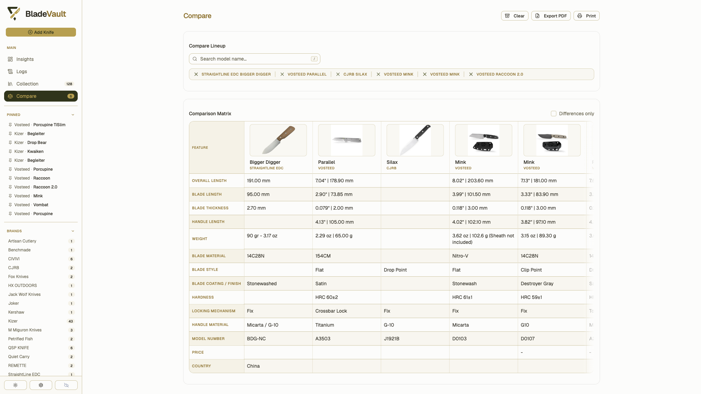
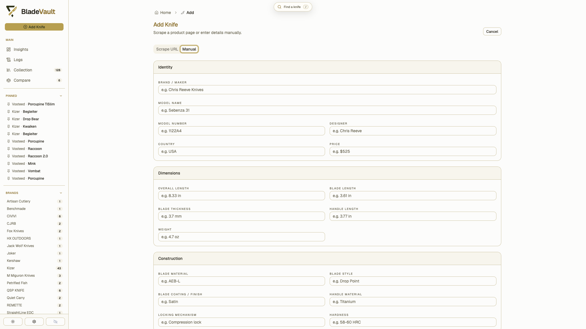

<div align="center">

  

  # BladeVault

  **A sharp, local-first knife collection manager.**

  Catalog your knives, compare them side by side, and keep your collection data under your control.

  <p>
    
    
    
    
    
    
    
    
  </p>

  <p>
    <a href="https://github.com/dedkola/bladevault/releases/latest">Download latest release</a>
    ·
    <a href="https://youtu.be/yurbpv0JY80">Watch the demo</a>
  </p>

</div>

---

## What it does

- Keep detailed knife records with specifications, pricing, provenance, notes, links, and a local image gallery.
- Search, filter, pin, group, and bulk-edit your collection—including reusable custom text, number, and date fields.
- Import product details from supported retailer URLs, with an interactive browser fallback for pages that need it.
- Compare any number of knives side by side, focus on differences, and export or print the table as a landscape PDF.
- See collection insights such as recent additions, maker distribution, and acquisition activity.
- Connect local AI clients through MCP to search and analyze the collection, find missing data or duplicates, and apply optional audited metadata updates.
- Run completely locally with SQLite, or opt into cloud backup when a BladeVault backup service is configured.

## Screenshots

<div align="center">

  
  <p><sub>Dashboard — recent additions and collection insights</sub></p>

  
  <p><sub>Knife detail — specifications, notes, and image gallery</sub></p>

  
  <p><sub>Compare — the details that matter, side by side</sub></p>

  
  <p><sub>Add knife — import a product URL or enter it yourself</sub></p>

</div>

## Choose a setup

| Option | Best for | Start here |
| --- | --- | --- |
| Desktop app | A native macOS or Windows experience | [Download the latest release](https://github.com/dedkola/bladevault/releases/latest) |
| Docker or Podman | A self-hosted local instance | [Run a container](#run-in-a-container) |
| Kubernetes | k3s or another Kubernetes cluster | [Install with Helm](#install-with-helm) |
| Source | Development and customization | [Run from source](#run-from-source) |

## Run in a container

The prebuilt image stores the database and downloaded images in `/app/data`. Mount a host folder to keep that data when the container is replaced.

### Docker on macOS or Linux

```bash
mkdir -p "$HOME/BladeVault/data"

docker run -d \
  --name bladevault \
  --restart unless-stopped \
  -p 5500:3000 \
  -v "$HOME/BladeVault/data:/app/data" \
  ghcr.io/dedkola/bladevault:latest
```

Open [http://localhost:5500](http://localhost:5500).

### Podman on macOS or Linux

```bash
mkdir -p "$HOME/BladeVault/data"

podman run -d \
  --name bladevault \
  --restart unless-stopped \
  -p 5500:3000 \
  -v "$HOME/BladeVault/data:/app/data" \
  ghcr.io/dedkola/bladevault:latest
```

### Docker on Windows

```powershell
docker run -d `
  --name bladevault `
  --restart unless-stopped `
  -p 5500:3000 `
  -v "${env:USERPROFILE}\BladeVault\data:/app/data" `
  ghcr.io/dedkola/bladevault:latest
```

### Docker Compose

The included Compose file builds this checkout and uses a named Docker volume:

```bash
docker compose up -d --build
```

It is available at [http://localhost:5500](http://localhost:5500). To stop it without deleting the persistent volume, run `docker compose down`.

### Build the image yourself

```bash
git clone https://github.com/dedkola/bladevault.git
cd bladevault
docker build -t bladevault .

docker run -d \
  --name bladevault \
  --restart unless-stopped \
  -p 5500:3000 \
  -v "$HOME/BladeVault/data:/app/data" \
  bladevault
```

## Install with Helm

The default chart is designed for k3s with MetalLB. It creates a dedicated
`LoadBalancer` address and a persistent 5 GiB volume for the SQLite database and
downloaded images.

### Install

```bash
helm repo add bladevault https://dedkola.github.io/bladevault

helm install bladevault bladevault/bladevault \
  --namespace bladevault \
  --create-namespace
```

Get the address, then open `http://<EXTERNAL-IP>`:

```bash
kubectl get service bladevault --namespace bladevault
```

If the repository was already added, run `helm repo update bladevault` before
installing.

### Update BladeVault

Each BladeVault release publishes a matching Helm chart and immutable container
image. After the GitHub **Build & Push Docker Image** and **Publish Helm
Repository** workflows complete, refresh the repository and upgrade the release:

```bash
helm repo update bladevault
helm upgrade bladevault bladevault/bladevault --namespace bladevault --wait
```

The chart version, displayed app version, and default image tag match the
BladeVault release. For example, chart `0.2.46` installs image `v0.2.46`.

If you explicitly override `image.tag=latest`, recreate the pod after a new
image is published because the mutable tag does not change the Deployment:

```bash
kubectl rollout restart deployment/bladevault --namespace bladevault
kubectl rollout status deployment/bladevault --namespace bladevault
```

### Remove BladeVault

```bash
helm uninstall bladevault --namespace bladevault
```

The chart keeps the `bladevault-data` PVC so uninstalling does not remove your
collection. To permanently delete the stored database and images too:

```bash
kubectl delete pvc bladevault-data --namespace bladevault
kubectl delete namespace bladevault
```

See the [chart README](charts/bladevault/README.md) for NGINX ingress with a
hostname, immutable image tags, existing PVCs, and other configuration.

## Desktop app

### macOS

Download [BladeVault.dmg](https://github.com/dedkola/bladevault/releases/latest/download/BladeVault.dmg), open it, then drag `BladeVault.app` to **Applications**.

Releases are unsigned. If macOS blocks the first launch, right-click the app, choose **Open**, and confirm. If needed, run:

```bash
xattr -d com.apple.quarantine "/Applications/BladeVault.app"
open "/Applications/BladeVault.app"
```

Updates use a user-assisted flow: select **Download update** in **Settings → About**, open the downloaded DMG, quit BladeVault, and replace the app in Applications.

### Windows

Download [BladeVault-Setup.exe](https://github.com/dedkola/bladevault/releases/latest/download/BladeVault-Setup.exe), run the installer, and open BladeVault from the Start menu or desktop shortcut.

Windows SmartScreen may show a warning for an unsigned build. Choose **More info** → **Run anyway** only if you trust the release source.

## Run from source

**Prerequisites:** Node.js 20 or newer. Install Chromium as well if you want to use URL import.

```bash
git clone https://github.com/dedkola/bladevault.git
cd bladevault
npm install
npx playwright install chromium
npm run dev
```

Open [http://localhost:3000](http://localhost:3000).

### Useful commands

| Command | Purpose |
| --- | --- |
| `npm run dev` | Start the Next.js development server. |
| `npm run build` | Create a production build. |
| `npm run start` | Serve the production build after `npm run build`. |
| `npm run lint` | Run ESLint. |
| `npm run format:check` | Check formatting with Prettier. |
| `npm run test` | Run the unit and integration suite once. |
| `npm run test:watch` | Run unit and integration tests in watch mode. |
| `npm run test:e2e` | Build the web app and run Chromium smoke tests. |
| `npm run test:e2e:ui` | Open Playwright's interactive test runner. |
| `npm run desktop:dev` | Run the Electron desktop shell in development. |
| `npm run desktop:smoke` | Build and smoke-test the desktop runtime. |
| `npm run dist:desktop` | Package desktop installers without publishing them. |

## Model Context Protocol (MCP)

BladeVault exposes its existing local collection to MCP clients such as LM
Studio, Codex, Claude Desktop, and Cursor. No separate database or cloud account
is required.

| Tool | Ability | Access |
| --- | --- | --- |
| `search_knives` | Search text and exact BladeVault fields | Read-only |
| `get_knife` | Retrieve one complete knife record | Read-only |
| `get_collection_stats` | Summarize completeness, categories, measurements, and recent records | Read-only |
| `find_missing_fields` | Find knives with missing built-in or custom fields | Read-only |
| `find_duplicates` | Score possible duplicate records without merging or deleting | Read-only |
| `propose_changes` | Validate suggested values without modifying the collection | Read-only |
| `update_knife` | Apply a timestamp-checked metadata update to one knife | Write mode |
| `bulk_update_knives` | Preview and atomically apply explicit multi-knife updates | Write mode |

Open **Settings → AI / MCP** to review activity, copy the local client
configuration, enable or disable HTTP access, and allow or deny metadata
writes. Write mode is off by default. Applied changes use optimistic locking
and are recorded in `knife_change_log`; MCP cannot replace IDs, timestamps,
images, or entire records.

### Connect an MCP client

Every URL-based connection uses the same configuration shape. Open
**Settings → AI / MCP** through the address you want to use and select **Copy
config**, or add the displayed URL and token manually:

```json
{
  "mcpServers": {
    "bladevault": {
      "url": "http://localhost:5500/mcp",
      "headers": {
        "Authorization": "Bearer <TOKEN_FROM_BLADEVAULT_SETTINGS>"
      }
    }
  }
}
```

| BladeVault runtime | MCP URL |
| --- | --- |
| Docker or Podman on the same computer | `http://localhost:5500/mcp` |
| Unraid or another LAN server | `http://<SERVER_IP>:5500/mcp` |
| macOS or Windows desktop app | `http://127.0.0.1:5501/mcp` |
| Source checkout | `http://localhost:3000/mcp` |

Replace the example URL when needed and replace the token placeholder with the
value shown in BladeVault Settings. The copy buttons work on plain HTTP LAN
addresses as well as secure origins.

For Docker or Podman, start the included Compose setup with:

```bash
docker compose up -d --build
```

For Unraid, map host port `5500` to container port `3000`. Keep the desktop app
running while its MCP connection is in use. If desktop port `5501` is busy,
BladeVault uses a free local port and **Copy config** includes the active URL.

BladeVault generates one permanent MCP access token and stores it with the
persisted vault data. The token stays the same across restarts and updates.

`MCP_AUTH_TOKEN`, `MCP_ALLOWED_HOSTS`, and `MCP_ALLOWED_ORIGINS` remain
available as deployment overrides. When `MCP_AUTH_TOKEN` is set, its value is
used instead of the app-generated token and is required for local and remote
HTTP connections.

`MCP_ENABLED` and `MCP_WRITE_ENABLED` remain available for administrators who
explicitly add deployment overrides. Setting either variable locks its
corresponding app control.

## Your data

BladeVault is local-first: it works without an account or API key.

| Runtime | Default data location |
| --- | --- |
| Source | `~/BladeVault/data` |
| Docker or Podman | `/app/data` inside the container; mount it to a host folder for persistence |
| Desktop development | `~/.bladevault-desktop-dev/data` |

The data directory contains `bladevault.sqlite` and downloaded images. Back up the whole folder to preserve the collection.

Set `BLADEVAULT_DATA_DIR` to choose a different directory for a source or container runtime. Existing installations that use the legacy repo-local `data/bladevault.sqlite` continue using it until the database is moved or `BLADEVAULT_DATA_DIR` is set.

The desktop app can also move its local data folder from Settings when the location is not managed by `BLADEVAULT_DATA_DIR`.

## Optional cloud backup

Cloud backup is opt-in and leaves local storage as the source of truth. When the app is configured with BladeVault authentication and backup service URLs, sign in from **Settings → Cloud Backup** to upload or restore a complete archive, including images. Automatic backups can run hourly and after collection changes.

Self-hosted deployments can omit those service URLs; the rest of BladeVault works entirely locally.

## License

BladeVault is released under the [MIT License](LICENSE).

<div align="center">
  <sub>Built with precision for knife enthusiasts.</sub>
</div>
