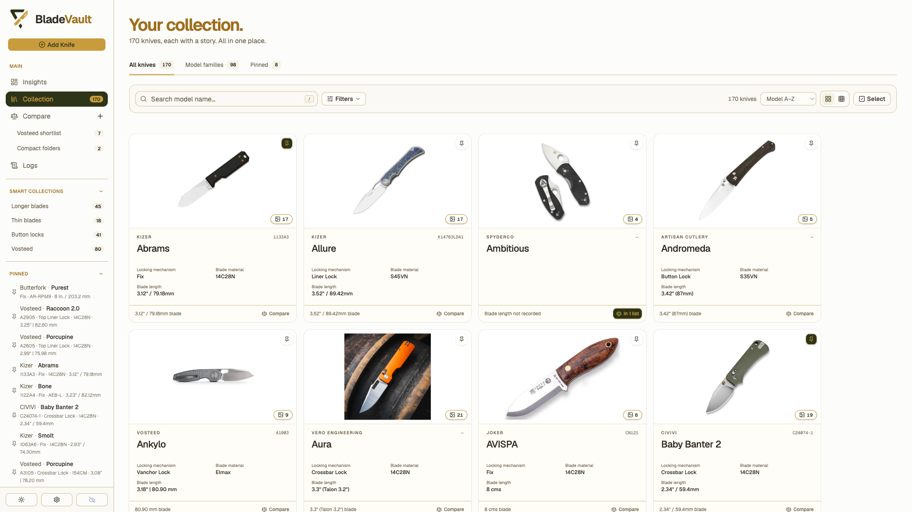
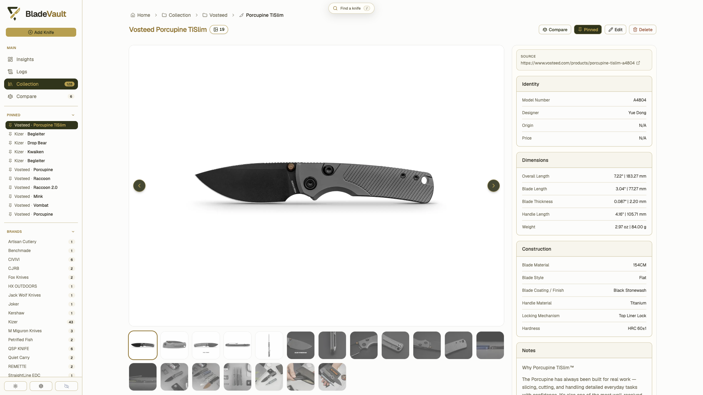
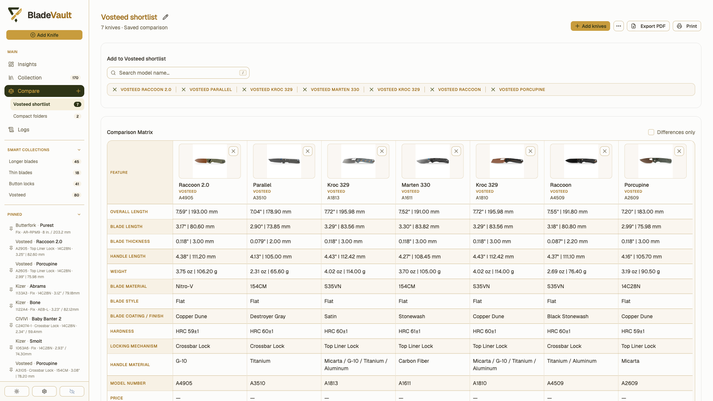

<div align="center">

  

# BladeVault

**A sharp, local-first knife collection manager.**

Catalog your knives, compare them side by side, and keep your collection data under your control.

  <p>
    
    
    
    
    
    
    
    
  </p>

  <p>
    <a href="https://github.com/dedkola/bladevault/releases/latest">Download latest release</a>
    ·
    <a href="https://youtu.be/yurbpv0JY80">Watch the demo</a>
  </p>

</div>

---

[Install](#choose-a-setup) · [Screenshots](#screenshots) · [MCP](#model-context-protocol-mcp) · [Backups](#local-backup-and-restore) · [Development](#run-from-source)

## What it does

- **Catalog:** Keep specifications, pricing, provenance, notes, links, and local photos for every knife. Import product details from supported retailer URLs, with an interactive browser fallback.
- **Capture source pages:** Save a full-page screenshot with URL imports, view or download it later, retry failed captures, and backfill screenshots for older records. Captures are included in local and cloud backups.
- **Organize:** Search, filter, pin, and bulk-edit records. Add custom text, number, and date fields, and choose which details appear on collection cards and in the pinned sidebar.
- **Browse:** Save filters as Smart Collections that update with your records, or browse variants together in Model families. Global search supports model names and `/model A4301` for model numbers.
- **Compare:** Create named shortlists, add a knife to several lists, show only differences, and print or export comparisons as PDF.
- **Maintain:** Log cleaning, lubrication, sharpening, stropping, and disassembly with dated notes and sharpening details. Review maintenance history and collection changes in Logs.
- **Understand:** Explore makers, materials, dimensions, completeness, and activity through collection insights. Open chart details to inspect matching knives or print the Overview as a report.
- **Connect:** Use MCP to search and analyze your collection from an AI client, with optional metadata updates and maintenance logging.
- **Keep control:** Store your vault locally in SQLite, create portable ZIP backups, and optionally sign in for cloud backup.

[Download the latest release](https://github.com/dedkola/bladevault/releases/latest) or browse the [full release history](https://github.com/dedkola/bladevault/releases).

## Choose a setup

| Option           | Best for                             | Start here                                                                           |
| ---------------- | ------------------------------------ | ------------------------------------------------------------------------------------ |
| Desktop app      | A native macOS or Windows experience | [Download the latest release](https://github.com/dedkola/bladevault/releases/latest) |
| Docker or Podman | A self-hosted local instance         | [Run a container](#run-in-a-container)                                               |
| Kubernetes       | k3s or another Kubernetes cluster    | [Install with Helm](#install-with-helm)                                              |
| Source           | Development and customization        | [Run from source](#run-from-source)                                                  |

## Screenshots

<div align="center">
  
  <p><sub>Collection — organize knives, browse model families, and save filters</sub></p>
</div>

<details>
<summary>More screenshots: insights, knife details, comparisons, and URL import</summary>

<div align="center">

  
  <p><sub>Insights — patterns, dimensions, materials, and collection health</sub></p>

  
  <p><sub>Knife detail — specifications, notes, and image gallery</sub></p>

  
  <p><sub>Compare — saved shortlists and specifications side by side</sub></p>

  
  <p><sub>Add knife — import a product URL or enter it yourself</sub></p>

</div>

</details>

## Run in a container

The prebuilt image stores the database and local images in `/app/data`. Mount a host folder to keep that data when the container is replaced.

The examples use `:latest`, which follows successful builds of `main` and can include changes newer than the published release. For a specific release, use its version tag, such as `ghcr.io/dedkola/bladevault:v1.3.1`.

### Docker on macOS or Linux

```bash
mkdir -p "$HOME/BladeVault/data"

docker run -d \
  --name bladevault \
  --restart unless-stopped \
  -p 5500:3000 \
  -v "$HOME/BladeVault/data:/app/data" \
  ghcr.io/dedkola/bladevault:latest
```

Open [http://localhost:5500](http://localhost:5500).

### Podman on macOS or Linux

```bash
mkdir -p "$HOME/BladeVault/data"

podman run -d \
  --name bladevault \
  --restart unless-stopped \
  -p 5500:3000 \
  -v "$HOME/BladeVault/data:/app/data" \
  ghcr.io/dedkola/bladevault:latest
```

### Docker on Windows

```powershell
docker run -d `
  --name bladevault `
  --restart unless-stopped `
  -p 5500:3000 `
  -v "${env:USERPROFILE}\BladeVault\data:/app/data" `
  ghcr.io/dedkola/bladevault:latest
```

### Docker Compose

The included Compose file builds the source and uses named Docker volumes for
the vault data and the bounded optimized-image cache. From a new checkout:

```bash
git clone https://github.com/dedkola/bladevault.git
cd bladevault
docker compose up -d --build
```

If you already have a checkout, run the Compose command from its root directory. Open [http://localhost:5500](http://localhost:5500). To stop it without deleting the persistent volume, run `docker compose down`.

### Build the image yourself

```bash
git clone https://github.com/dedkola/bladevault.git
cd bladevault
docker build -t bladevault .

docker run -d \
  --name bladevault \
  --restart unless-stopped \
  -p 5500:3000 \
  -v "$HOME/BladeVault/data:/app/data" \
  bladevault
```

## Install with Helm

The default chart is designed for k3s with MetalLB. It creates a dedicated
`LoadBalancer` address and a persistent 5 GiB volume for the SQLite database and
downloaded images.

### Install

```bash
helm repo add bladevault https://dedkola.github.io/bladevault

helm install bladevault bladevault/bladevault \
  --namespace bladevault \
  --create-namespace
```

Get the address, then open `http://<EXTERNAL-IP>`:

```bash
kubectl get service bladevault --namespace bladevault
```

If the repository was already added, run `helm repo update bladevault` before
installing.

### Update BladeVault

Each BladeVault release publishes a matching Helm chart and immutable container
image. After the GitHub **Build & Push Docker Image** and **Publish Helm
Repository** workflows complete, refresh the repository and upgrade the release:

```bash
helm repo update bladevault
helm upgrade bladevault bladevault/bladevault --namespace bladevault --wait
```

The chart version, displayed app version, and default image tag match the
BladeVault release. For example, chart `1.3.1` installs image `v1.3.1`.

If you explicitly override `image.tag=latest`, recreate the pod after a new
image is published because the mutable tag does not change the Deployment:

```bash
kubectl rollout restart deployment/bladevault --namespace bladevault
kubectl rollout status deployment/bladevault --namespace bladevault
```

### Remove BladeVault

```bash
helm uninstall bladevault --namespace bladevault
```

The chart keeps the `bladevault-data` PVC so uninstalling does not remove your
collection. To permanently delete the stored database and images too:

```bash
kubectl delete pvc bladevault-data --namespace bladevault
kubectl delete namespace bladevault
```

See the [chart README](charts/bladevault/README.md) for NGINX ingress with a
hostname, immutable image tags, existing PVCs, and other configuration.

## Desktop app

### macOS

BladeVault requires macOS 13 Ventura or newer.

Download [BladeVault.dmg](https://github.com/dedkola/bladevault/releases/latest/download/BladeVault.dmg), open it, then drag `BladeVault.app` to **Applications**.

Releases are unsigned. If macOS blocks the first launch, right-click the app, choose **Open**, and confirm. If needed, run:

```bash
xattr -d com.apple.quarantine "/Applications/BladeVault.app"
open "/Applications/BladeVault.app"
```

Updates use a user-assisted flow: select **Download update** in **Settings → About**, open the downloaded DMG, quit BladeVault, and replace the app in Applications.

### Windows

Download [BladeVault-Setup.exe](https://github.com/dedkola/bladevault/releases/latest/download/BladeVault-Setup.exe), run the installer, and open BladeVault from the Start menu or desktop shortcut.

Windows SmartScreen may show a warning for an unsigned build. Choose **More info** → **Run anyway** only if you trust the release source.

Check for updates in **Settings → About**. Download an available update, then select **Restart to update** to install it.

## Run from source

**Prerequisites:** Node.js 24 LTS. The repository pins Node.js 24.21.0 in [`.nvmrc`](.nvmrc) for local development and CI. Install Chromium as well if you want to use URL import and webpage capture.

```bash
git clone https://github.com/dedkola/bladevault.git
cd bladevault
npm ci
npx playwright install chromium
npm run dev
```

Open [http://localhost:3000](http://localhost:3000).

### Production server

Build the app, copy its public files and static assets into the standalone output, then start the generated server:

```bash
npm run build
node -e "const fs = require('node:fs'); for (const dir of ['public', '.next/static']) fs.cpSync(dir, '.next/standalone/' + dir, { recursive: true });"
node .next/standalone/server.js
```

Open [http://localhost:3000](http://localhost:3000). This project uses Next.js standalone output; use the generated server for production.

### Useful commands

| Command                 | Purpose                                             |
| ----------------------- | --------------------------------------------------- |
| `npm run dev`           | Start the Next.js development server.               |
| `npm run build`         | Create a production build.                          |
| `npm run lint`          | Run ESLint.                                         |
| `npm run format:check`  | Check formatting with Prettier.                     |
| `npm run test`          | Run the unit and integration suite once.            |
| `npm run test:watch`    | Run unit and integration tests in watch mode.       |
| `npm run test:e2e`      | Build the web app and run Chromium smoke tests.     |
| `npm run test:e2e:ui`   | Open Playwright's interactive test runner.          |
| `npm run mcp:build`     | Build the MCP stdio entry point.                    |
| `npm run mcp`           | Build and start the MCP stdio server.               |
| `npm run desktop:dev`   | Run the Electron desktop shell in development.      |
| `npm run desktop:smoke` | Build and smoke-test the desktop runtime.           |
| `npm run dist:desktop`  | Package desktop installers without publishing them. |

## Model Context Protocol (MCP)

BladeVault exposes its existing local collection to MCP clients such as LM
Studio, Codex, Claude Desktop, and Cursor. No separate database or cloud account
is required.

| Tool                    | Ability                                                              | Access     |
| ----------------------- | -------------------------------------------------------------------- | ---------- |
| `search_knives`         | Search text and exact BladeVault fields                              | Read-only  |
| `get_knife`             | Retrieve one complete knife record                                   | Read-only  |
| `get_collection_stats`  | Summarize completeness, categories, measurements, and recent records | Read-only  |
| `find_missing_fields`   | Find knives with missing built-in or custom fields                   | Read-only  |
| `find_duplicates`       | Score possible duplicate records without merging or deleting         | Read-only  |
| `propose_changes`       | Validate suggested values without modifying the collection           | Read-only  |
| `update_knife`          | Apply a timestamp-checked metadata update to one knife               | Write mode |
| `bulk_update_knives`    | Preview and atomically apply explicit multi-knife updates            | Write mode |
| `get_knife_maintenance` | Retrieve maintenance history for one knife                           | Read-only  |
| `add_maintenance_event` | Log a maintenance event for one knife                                | Write mode |

Open **Settings → AI / MCP** to review activity, copy the local client
configuration, enable or disable HTTP access, and allow or deny write access. Write mode is off by default. Metadata updates require the expected
record timestamp to prevent overwriting newer edits and are recorded in the
change log. Maintenance writes append dated events to a knife's history. MCP
cannot replace knife IDs, record timestamps, images, or entire records.

### Connect an MCP client

Client configuration formats differ. Open **Settings → AI / MCP** through the
address you want to use and select **Copy config**, or copy the displayed URL
and token into your client's settings. For clients that accept an `mcpServers`
JSON configuration:

```json
{
  "mcpServers": {
    "bladevault": {
      "url": "http://localhost:5500/mcp",
      "headers": {
        "Authorization": "Bearer <TOKEN_FROM_BLADEVAULT_SETTINGS>"
      }
    }
  }
}
```

| BladeVault runtime                    | MCP URL                       |
| ------------------------------------- | ----------------------------- |
| Docker or Podman on the same computer | `http://localhost:5500/mcp`   |
| Unraid or another LAN server          | `http://<SERVER_IP>:5500/mcp` |
| macOS or Windows desktop app          | `http://127.0.0.1:5501/mcp`   |
| Source checkout                       | `http://localhost:3000/mcp`   |

Replace the example URL when needed and replace the token placeholder with the
value shown in BladeVault Settings. The copy buttons work on plain HTTP LAN
addresses as well as secure origins.

#### Codex

To connect Codex, add BladeVault to `~/.codex/config.toml`:

```toml
[mcp_servers.bladevault]
enabled = true
url = "http://<UNRAID_IP>:5500/mcp"
http_headers = { Authorization = "Bearer <TOKEN_FROM_BLADEVAULT_SETTINGS>" }
```

Use `http://localhost:5500/mcp` for Docker or Podman on the same computer, or
use the active desktop URL shown in **Settings → AI / MCP**. Restart Codex after
changing its configuration.

Codex also supports `bearer_token_env_var`, but its value must be the name of
an environment variable containing the raw token, not `Bearer` followed by the
token itself. The `http_headers` example above matches BladeVault's copied
client configuration directly.

For container setup, see [Run in a container](#run-in-a-container).

For Unraid, map host port `5500` to container port `3000`. Keep the desktop app
running while its MCP connection is in use. If desktop port `5501` is busy,
BladeVault uses a free local port and **Copy config** includes the active URL.

BladeVault generates one permanent MCP access token and stores it with the
persisted vault data. The token stays the same across restarts and updates.

`MCP_AUTH_TOKEN`, `MCP_ALLOWED_HOSTS`, and `MCP_ALLOWED_ORIGINS` remain
available as deployment overrides. When `MCP_AUTH_TOKEN` is set, its value is
used instead of the app-generated token and is required for local and remote
HTTP connections.

`MCP_ENABLED` and `MCP_WRITE_ENABLED` remain available for administrators who
explicitly add deployment overrides. Setting either variable locks its
corresponding app control.

### Connect over stdio from source

For clients that launch a local MCP process, build the stdio entry point from
your source checkout:

```bash
npm run mcp:build
```

Configure your client to run the built entry point directly:

```json
{
  "mcpServers": {
    "bladevault": {
      "command": "node",
      "args": ["/absolute/path/to/bladevault/dist/mcp/bladevault.mjs", "mcp"],
      "env": {
        "BLADEVAULT_DATA_DIR": "/absolute/path/to/BladeVault/data"
      }
    }
  }
}
```

Replace both paths with your checkout and existing vault data folder. Use an
absolute path to your Node.js 24 executable if your client cannot find `node`.
The client starts the process, so the web or desktop app does not need to be
running. Stdio uses the same local database and write-access settings and does
not require an HTTP token. To start the stdio server manually, run `npm run mcp`.

## Your data

BladeVault is local-first: it works without an account or API key.

| Runtime                         | Default data location                                                       |
| ------------------------------- | --------------------------------------------------------------------------- |
| Source or installed desktop app | `~/BladeVault/data` (`%USERPROFILE%\BladeVault\data` on Windows)            |
| Docker or Podman                | `/app/data` inside the container; mount it to a host folder for persistence |
| Desktop development             | `~/.bladevault-desktop-dev/data`                                            |

The data directory contains `bladevault.sqlite` and local images. **Settings → Local storage** shows the active folder.

Set `BLADEVAULT_DATA_DIR` to choose a different directory for a source or container runtime. Without an explicit folder setting, BladeVault checks the default folder and legacy locations, including repo-local `data/bladevault.sqlite` and older macOS app folders, and uses the existing database with the most knives.

The desktop app can also move its local data folder from Settings when the location is not managed by `BLADEVAULT_DATA_DIR`.

### Local backup and restore

Open **Settings → Backup & Restore → Download ZIP** to save a portable full-vault backup without a cloud account. The archive includes the database, collection settings, Smart Collections, saved comparisons, history, and local images.

Use **Restore from local ZIP** in the same panel to validate an archive and review its contents before replacing the current vault. BladeVault creates a safety copy of the current data before restoring. The panel also offers **Print Report** to open the Overview for printing or saving as a PDF.

Saved comparisons are included in full-vault backups, but changing a comparison list does not trigger an automatic cloud backup. When upgrading from before v1.2.0, the old comparison selection becomes **My comparison**.

For a manual filesystem backup, stop BladeVault and copy the whole data folder so the database and images stay together.

## Optional cloud backup

Cloud backup is opt-in and leaves local storage as the source of truth. BladeVault uses `https://auth.bladevault.pro` and `https://backup.bladevault.pro` by default. Sign in from **Settings → Cloud Backup** to upload or restore a complete archive, including images. Enable automatic backup to run hourly and after collection changes.

Deployments can override the service endpoints with `NEXT_PUBLIC_BLADEVAULT_AUTH_URL` and `NEXT_PUBLIC_BLADEVAULT_BACKUP_URL`. Leaving them unset uses the built-in defaults. You can use the local vault and ZIP backups without signing in.

## License

BladeVault is released under the [MIT License](LICENSE).

<div align="center">
  <sub>Built with precision for knife enthusiasts.</sub>
</div>
